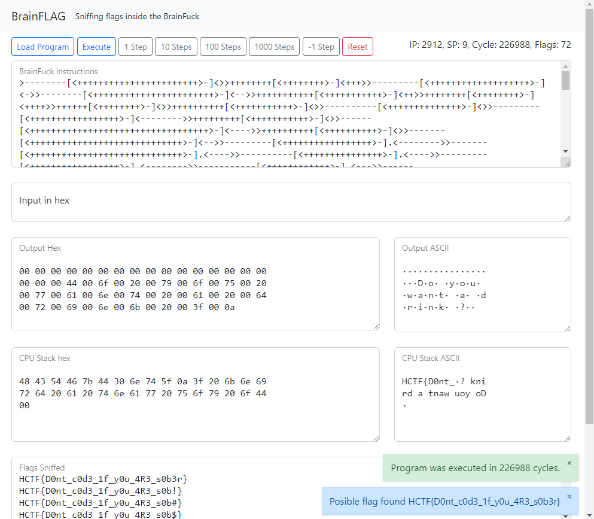

# BrainFLAG
A BrainFuck debugger and scanner for CTF flags



# Examples

## Example 1
Example code from the [Hackappatoi 2022](https://hackappatoi.github.io/):
```brainfuck
>--------[<+++++++++++++++++++++++>-]<>>++++++++[<++++++++>-]<+++>>---------[<+++++++++++++++++++>-]<->>--------[<+++++++++++++++++++++++>-]<-->>+++++++++++[<+++++++++++>-]<++>>++++++++[<++++++++>-]<++++>>++++++[<++++++++>-]<>>++++++++++[<+++++++++++>-]<>>----------[<++++++++++++++>-]<>>---------[<+++++++++++++++++>-]<-------->>+++++++++[<+++++++++++>-]<>>------[<++++++++++++++++++++++++++++++++++>-]<---->>++++++++++[<++++++++++>-]<>>-------[<+++++++++++++++++++++++++++++>-]<-->>---------[<+++++++++++++++++>-].<-------->>-------[<+++++++++++++++++++++++++++++>-].<---->>----------[<+++++++++++++++>-].<---->>---------[<+++++++++++++++++>-].<-------->>-----------[<++++++++++++>-].<--->>------[<++++++++++++++++++++++++++++++++++>-].<---->>----------[<+++++++++++++>-].<--------->>+++++++++[<++++++++++>-].<+++++>>+++++++[<+++++++>-].<+++>>---------[<+++++++++++++++++++>-].<--->>+++++++[<+++++++>-].<++>>+++++++++[<++++++++++>-].<+++++>>----------[<++++++++++++++>-].<->>------[<++++++++++++++++++++++++++++++++++>-].<---->>+++++++++[<++++++++++>-].<++++++++>>-------[<+++++++++++++++++++++++++++++>-].<-->>++++++++++[<+++++++++++>-].<++++>>+++++++++++[<+++++++++++>-].<++++><>++++++++++++++[<++++++++++++++>-].<+++.<>>+++++++++++++++[<<++++++++++++++++>>-].<<+++++++++++++.<>>>+++++++++++++++[<<<+++++++++++++++>>>-].<<<++++++++++++.<>>>>----[<<<<++++++++++++++++++++++++++++++++++++++++++++++++++++++++++>>>>-].<<<<-.<>>>>>+++++++[<<<<<+++++++++>>>>>-].<<<<<.<>>>>>>+[<<<<<<++>>>>>>-].<<<<<<.<>>>>>>>+++++++++++++[<<<<<<<++++++++++++++>>>>>>>-].<<<<<<<+++++++++++.<>>>>>>>>--------[<<<<<<<<+++++++++++++++++++++++>>>>>>>>-].<<<<<<<<----.<>>>>>>>>>+++[<<<<<<<<<+++++>>>>>>>>>-].<<<<<<<<<.<>>>>>>>>>>+++++++[<<<<<<<<<<++++++++>>>>>>>>>>-].<<<<<<<<<<++.<>>>>>>>>>>>++++[<<<<<<<<<<<+++++>>>>>>>>>>>-].<<<<<<<<<<<+.<>>>>>>>>>>>>-------------[<<<<<<<<<<<<++++++>>>>>>>>>>>>-].<<<<<<<<<<<<-------.<>>>>>>>>>>>>>+++++++[<<<<<<<<<<<<<+++++++>>>>>>>>>>>>>-].<<<<<<<<<<<<<.<>>>>>>>>>>>>>>------------[<<<<<<<<<<<<<<+++++++>>>>>>>>>>>>>>-].<<<<<<<<<<<<<<-----.<>>>>>>>>>>>>>>>++[<<<<<<<<<<<<<<<++>>>>>>>>>>>>>>>-].<<<<<<<<<<<<<<<+.<>>>>>>>>>>>>>>>>+++[<<<<<<<<<<<<<<<<++++>>>>>>>>>>>>>>>>-].<<<<<<<<<<<<<<<<.<>>>>>>>>>>>>>>>>>+++++++[<<<<<<<<<<<<<<<<<++++++++>>>>>>>>>>>>>>>>>-].<<<<<<<<<<<<<<<<<.<>>>>>>>>>>>>>>>>>>+++[<<<<<<<<<<<<<<<<<<+++++>>>>>>>>>>>>>>>>>>-].<<<<<<<<<<<<<<<<<<.<>>>>>>>>>>>>>>>>>>>-------[<<<<<<<<<<<<<<<<<<<++++++++++++++++++++++++++++>>>>>>>>>>>>>>>>>>>-].<<<<<<<<<<<<<<<<<<<----.<>>>>>>>>>>>>>>>>>>>>+++++++++++++[<<<<<<<<<<<<<<<<<<<<++++++++++++++>>>>>>>>>>>>>>>>>>>>-].<<<<<<<<<<<<<<<<<<<<++++++.<>>>>>>>>>>>>>>>>>>>>>---[<<<<<<<<<<<<<<<<<<<<<++++++++++++++++++++++++++++++++++++++++++++++++++++++++++++++++++++++++++++++++>>>>>>>>>>>>>>>>>>>>>-].<<<<<<<<<<<<<<<<<<<<<-.<>>>>>>>>>>>>>>>>>>>>>>------------[<<<<<<<<<<<<<<<<<<<<<<+++++++>>>>>>>>>>>>>>>>>>>>>>-].<<<<<<<<<<<<<<<<<<<<<<-----.<
```
Flag retrieved from scanning the data memory durring execution:
```
HCTF{D0nt_c0d3_1f_y0u_4R3_s0b3r}
```

## Example 2
Example from [Tenable CTF 2021](https://www.tenable.com/):
```
--[----->+<]>.++++++.-----------.++++++.[----->+<]>.----.---.+++[->+++<]>+.-------.++++++++++.++++++++++.++[->+++<]>.+++.[--->+<]>----.+++[->+++<]>++.++++++++.+++++.--------.-[--->+<]>--.+[->+++<]>+.++++++++.>--[-->+++<]>.
```

Flag retrieved from output:
```
flag{wtf_is_brainfuck}
```
